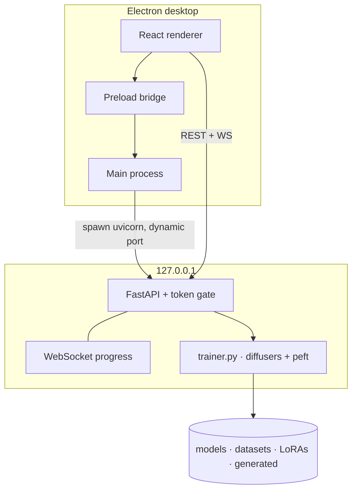

<div align="center">

# LoRA Studio

**Local LoRA training for Stable Diffusion — from dataset to adapter, in one desktop app.**

Prepare images, download a base model, train a LoRA, and test it in the playground. Everything stays on your machine.

[](https://github.com/NIHILcoder/LoraTraining/releases)
[](#requirements)
[](LICENSE)
[](#architecture)

[Download](https://github.com/NIHILcoder/LoraTraining/releases/latest) · [Changelog](CHANGELOG.md) · [Roadmap](docs/ROADMAP.md)

</div>

---

## Why LoRA Studio

Kohya, sd-scripts, and notebook workflows are powerful — and scattered across terminals, YAML, and Python environments. LoRA Studio wraps that loop into a Windows desktop app:

| You need | LoRA Studio does |
| --- | --- |
| A Python + CUDA env | First-run setup via `uv` (Python 3.12, PyTorch CUDA 12.1) |
| A base checkpoint | Catalog downloads with resume + SHA256 for SD 1.5 and SDXL |
| Captioned images | Local import, bulk caption tools, optional BLIP auto-caption |
| Training that matches the UI | `trainingSteps` = optimizer updates; dropout / flip applied per step |
| A LoRA you can actually load | Saved in **Kohya / A1111 / ComfyUI** key format |
| A sanity check | Built-in playground + gallery, PNG-info compatible with Civitai |

This is an **active beta**. Training quality still depends on your GPU, driver, VRAM, dataset, and base model. SD 1.5 and SDXL are the supported training/inference pair; other families are listed in the catalog as coming soon.

---

## Features

<table>
<tr>
<td width="50%" valign="top">

### Dataset
- Local PNG / JPEG / WEBP import
- Thumbnails, tags, and per-image captions
- Bulk prepend / append / find-replace
- Batch auto-caption (BLIP)
- Atomic image delete (no stale full-dataset rewrite)

</td>
<td width="50%" valign="top">

### Training
- SD 1.5 (512) and SDXL (1024)
- Rank, alpha, LR, cosine / constant, warmup
- Gradient accumulation, caption dropout, noise offset
- Aspect-ratio bucketing and latent cache
- Hardware panel: VRAM, feasibility, ETA
- Live loss, logs, and cooperative stop

</td>
</tr>
<tr>
<td width="50%" valign="top">

### Models
- Catalog: SD 1.5, SD 2.1, SDXL
- Resumable downloads (keeps `.part` on cancel)
- SHA256 verification (SD 1.5, SDXL)
- Import a local `.safetensors`
- Custom URL registration (safetensors only)
- Hugging Face token for gated repos

</td>
<td width="50%" valign="top">

### Playground & gallery
- txt2img with optional trained LoRA
- Seed reuse, CFG, sampler, LoRA weight
- Batch generation with unique seeds
- A1111 / Civitai PNG metadata
- Gallery for adapters and generated images
- Open output folders in Explorer

</td>
</tr>
</table>

<details>
<summary><strong>Architecture support</strong></summary>

<br/>

| Family | Train | Generate | Notes |
| --- | :---: | :---: | --- |
| **SD 1.5** | Yes | Yes | Recommended starting point · ~8 GB VRAM |
| **SDXL 1.0** | Yes | Yes | 1024 native · 12 GB+ VRAM recommended |
| **SD 2.1** | — | Yes | Training gated (OpenCLIP + v-prediction not finished) |
| **SD 3 / Flux / Cascade** | — | — | Shown in the hub as coming soon; download disabled |

</details>

---

## Screenshots

The desktop shell is a dark training workspace: dataset on the left, config in the center, hardware + live run on the right. Models, Playground, and Gallery are separate pages in the sidebar.

> Installer and in-app screenshots will land here once a tagged `1.0.0-beta.2` build is published.

---

## Requirements

| | Minimum | Comfortable |
| --- | --- | --- |
| OS | Windows 10 / 11 (x64) | Windows 11 |
| GPU | NVIDIA, CUDA-capable | RTX 3060 12 GB or better |
| VRAM | 8 GB (SD 1.5, batch 1) | 12–16 GB (SDXL) |
| RAM | 16 GB | 32 GB |
| Disk | ~15 GB for env + one SD 1.5 | 40 GB+ if you keep SDXL too |
| Network | Required for first setup and model downloads | |

CPU-only machines can open the UI. Training and real inference need a CUDA GPU; without one the playground returns a mock placeholder instead of a silent fake success.

---

## Install

### Packaged app

1. Grab the latest **NSIS installer** from [Releases](https://github.com/NIHILcoder/LoraTraining/releases).
2. Run `LoRA Studio Setup <version>.exe`.
3. On first launch, let the setup screen build the Python environment (this downloads `uv`, Python 3.12, CUDA PyTorch, and `backend/requirements.txt`).
4. Download **SD 1.5** or **SDXL** from Models, then start a dataset.

The app is currently **unsigned**. Windows SmartScreen may warn on first install; “More info → Run anyway” is expected until code signing is added.

Installed builds auto-update from GitHub Releases via `electron-updater`. Dev sessions do not.

### From source

```powershell
git clone https://github.com/NIHILcoder/LoraTraining.git
cd LoraTraining
npm install
npm run electron:dev
```

That builds the Electron main process, starts the renderer on `http://localhost:3005`, then launches the desktop window. The Python backend is spawned automatically after setup (preferred port `8000`, next free port if busy).

---

## Development

| Command | What it does |
| --- | --- |
| `npm run electron:dev` | Full desktop loop (renderer + Electron + backend) |
| `npm run dev` | Renderer only on port `3005` (no IPC / no trainer) |
| `npm run type-check` | TypeScript, no emit |
| `npm test` | Vitest |
| `npm run build` | Production renderer + main + preload → `dist/` |
| `npm run electron:dist` | NSIS installer → `dist/release/` |
| `npm run electron:publish` | Build and publish to GitHub Releases |

Manual backend (debugging the env the app created):

```powershell
cd backend
& "$env:APPDATA\LoRA Studio\backend-env\Scripts\python.exe" -m uvicorn main:app --host 127.0.0.1 --port 8000
```

Packaged builds store the env under Electron `userData` (`%APPDATA%\LoRA Studio`). Dev sessions may use a different folder — check the setup screen logs if the path above is empty.

### Layout

```text
.
├── backend/                 FastAPI + trainer (diffusers, peft, accelerate)
├── installer-assets/        NSIS header / sidebar bitmaps
├── public/                  HTML shell
├── src/
│   ├── components/          Workspace, setup, shared UI
│   ├── context/             App state
│   ├── hooks/               WebSocket client
│   ├── pages/               Models, Playground, Gallery, workspace
│   ├── services/            REST client
│   ├── backend_manager.ts   uv env + uvicorn process
│   └── main.ts              Electron main
├── CHANGELOG.md
└── docs/ROADMAP.md
```

Weights, datasets, `node_modules/`, and `dist/` are gitignored.

---

## Architecture



- The API binds to **localhost only** and requires a per-session token (`LORA_STUDIO_API_TOKEN`).
- File endpoints resolve paths under known roots (`assert_under`) so `..` cannot escape the models / output / dataset dirs.
- Custom checkpoints must be `.safetensors`. Pickle formats (`.ckpt`, `.bin`, `.pt`) are rejected.

Do not expose the backend port. Do not load weights from untrusted URLs.

---

## Release

Current version: **`1.0.0-beta.2`**.

```powershell
# 1. Bump "version" in package.json (must be strictly higher for auto-update)
# 2. Publish installer + latest.yml
$env:GH_TOKEN = "<repo-scoped token>"
npm run electron:publish
```

`npm run electron:dist` builds locally without uploading.

---

## Troubleshooting

<details>
<summary><strong>Packaged app opens to a black screen</strong></summary>

<br/>

Production assets must use a relative public path:

```js
publicPath: isDev ? '/' : './'
```

The packaged app loads `dist/index.html` via `loadFile()`. Absolute paths like `/renderer.js` break under `file://`.

</details>

<details>
<summary><strong>Routes 404 after packaging</strong></summary>

<br/>

The renderer uses `HashRouter` under `file://` and `BrowserRouter` on the webpack dev server.

</details>

<details>
<summary><strong><code>electron-builder</code> fails with <code>spawn EPERM</code></strong></summary>

<br/>

Windows permissions, antivirus, or a sandbox is blocking `node_modules/app-builder-bin/win/x64/app-builder.exe`. Run from a normal trusted terminal, or allow that binary.

</details>

<details>
<summary><strong>First setup takes a long time</strong></summary>

<br/>

Expected. The setup screen pulls a Python runtime, CUDA PyTorch wheels, and Hugging Face / Civitai checkpoints. Leave the window open; cancelled downloads keep a `.part` file and resume next time.

</details>

<details>
<summary><strong>Training or playground fails with CUDA / VRAM errors</strong></summary>

<br/>

Drop resolution, batch size, or rank. Prefer SD 1.5 on 8 GB cards. SDXL wants 12 GB+. Mixed precision `bf16` needs a recent NVIDIA GPU; use `fp16` or `fp32` otherwise.

</details>

---

## License

[MIT](LICENSE) © 2026 Proxy Nihil
