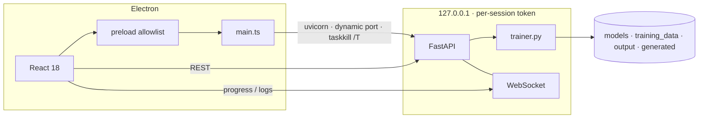

<p align="center">
  
</p>

<p align="center">
  <a href="https://github.com/NIHILcoder/LoraTraining/releases/latest"></a>
  <a href="#runtime"></a>
  <a href="#training-engine"></a>
  <a href="LICENSE"></a>
</p>

<p align="center">
  <a href="https://github.com/NIHILcoder/LoraTraining/releases/latest">Latest installer</a>
  &nbsp;·&nbsp;
  <a href="CHANGELOG.md">Changelog</a>
  &nbsp;·&nbsp;
  <a href="docs/ROADMAP.md">Roadmap</a>
  &nbsp;·&nbsp;
  <a href="#architecture">Architecture</a>
</p>

---

**LoRA Studio** is a Windows desktop application that owns the full local adapter loop: dataset intake, base-checkpoint management, LoRA training, txt2img evaluation, and Kohya-compatible export. It is not a notebook wrapper and not a remote service. Electron hosts the UI; a FastAPI process on `127.0.0.1` runs training and inference against a CUDA PyTorch environment the app provisions itself.

The current public line is **`1.0.0-beta.2`**. SD 1.5 and SDXL are the supported train/generate pair. Everything else in the catalog is either inference-only or explicitly gated.

<table>
  <tr>
    <td width="25%"><sub>PRODUCT</sub><br/><b>Local training studio</b></td>
    <td width="25%"><sub>EXPORT</sub><br/><b>Kohya / A1111 / ComfyUI keys</b></td>
    <td width="25%"><sub>RUNTIME</sub><br/><b>Python 3.12 · CUDA 12.1</b></td>
    <td width="25%"><sub>SURFACE</sub><br/><b>Electron 30 · FastAPI</b></td>
  </tr>
</table>

## Contents

1. [Position](#position)
2. [Status of this beta](#status-of-this-beta)
3. [Pipeline](#pipeline)
4. [Training engine](#training-engine)
5. [Compatibility](#compatibility)
6. [Runtime](#runtime)
7. [Install](#install)
8. [Development](#development)
9. [Architecture](#architecture)
10. [Security model](#security-model)
11. [Release engineering](#release-engineering)
12. [Operations](#operations)
13. [License](#license)

## Position

Adapter training on Stable Diffusion is still mostly a composition of `sd-scripts`, YAML, a hand-built venv, and a separate WebUI for sampling. That split is where datasets get mistagged, steps get miscounted, and the file that lands on disk does not load in the UI the user actually runs.

LoRA Studio collapses that composition into one process graph:

- The **renderer** is the only control surface (dataset, config, models, playground, gallery).
- The **backend** is the only place weights are loaded. The UI never talks to PyTorch directly.
- The **trainer** is a single `diffusers` + `peft` loop whose knobs match the labels in the workspace — including what “a step” means.
- The **artifact** is a `.safetensors` adapter with Kohya-format keys, plus A1111/Civitai PNG-info on generated images.

If you already live in Kohya GUI, this is a narrower, more opinionated environment: fewer architectures, fewer optimizers, a harder security boundary, and a workspace that is supposed to be truthful about VRAM and remaining time.

## Status of this beta

Treat `1.0.0-beta.2` as a usable local tool, not a finished training suite.

| Contract | Today |
| --- | --- |
| Train | SD 1.5 (512) and SDXL (1024), UNet LoRA only |
| Generate | SD 1.5, SD 2.1, SDXL — real CUDA path, or an explicit mock if no GPU / no checkpoint |
| Catalog but gated | SD 3, Flux, Stable Cascade — listed as coming soon; download disabled |
| Not in this build | Sample previews during training, checkpoints / resume, img2img, multi-LoRA, signed installer, CI |

Training quality is still a function of GPU, driver, VRAM, caption quality, and the base checkpoint. The app will not invent a good LoRA from a bad set.

## Pipeline

```text
 images ──► dataset (captions, buckets)
                 │
 catalog / local .safetensors ──► base checkpoint
                 │
                 ▼
         trainer.py  (latent cache → micro-batches → optimizer)
                 │
                 ▼
      Kohya-format LoRA ──► playground txt2img ──► gallery
```

| Stage | What the product actually does |
| --- | --- |
| **Dataset** | Copies local PNG / JPEG / WEBP under the training-data root, reads real pixel size (for bucketing), stores captions as tags. Bulk prepend / append / find-replace and BLIP auto-caption persist via PATCH so a stale client snapshot cannot overwrite the rest of the set. |
| **Base model** | Catalog download with HTTP Range resume. Cancel **keeps** the `.part` file. SD 1.5 and SDXL verify SHA-256. Local `.safetensors` import and custom URLs are allowed; `.ckpt` / `.bin` / `.pt` are rejected. |
| **Train** | HTTP `POST /api/training/start` creates the session and the asyncio task. Progress is WebSocket-only. Stop is cooperative. |
| **Evaluate** | Playground injects the selected adapter, serializes GPU work, writes PNG + sidecar JSON, embeds generation parameters in PNG text chunks. |
| **Export** | Adapter directory under the output root; Explorer open/delete are path-confined to that root. |

## Training engine

Implementation: `backend/trainer.py` on **diffusers**, **peft**, and **accelerate**, with versions pinned in `backend/requirements.txt`.

The loop is built so the workspace labels are not decorative:

| Control | Behaviour |
| --- | --- |
| **Training steps** | Optimizer updates. The inner loop runs `steps × gradient_accumulation` micro-batches. The LR schedule and the UI counter use the same unit. |
| **Gradient accumulation** | `N` micro-batches per `optimizer.step()`. |
| **Mixed precision** | `bf16` / `fp16` use CUDA autocast. **`fp32` disables AMP** and runs in float32. |
| **Caption dropout / hflip** | Applied per micro-batch on cached latents and text embeddings. They are **not** baked into the cache. |
| **Aspect-ratio bucketing** | Groups by ratio so 1:1 training does not stretch the set. |
| **Latent cache** | VAE encode and text encode once; UNet trains against cached tensors. |
| **Noise offset** | Optional brightness-range offset on the noise. |
| **Prediction type** | If the scheduler is `v_prediction`, the target is velocity — not epsilon. |
| **Text encoder** | Frozen. The profile flag exists for compatibility; this build does not train it. |
| **Save format** | PEFT state is converted to **Kohya** keys (`lora_unet_*_lora_down/up.weight` + `.alpha`) so Automatic1111 and ComfyUI can load the file. |

Hardware panel: VRAM, CUDA, RAM, per-architecture feasibility, and an ETA that **increases** with batch size. SD 2.1 / SD3 / Flux / Cascade tiles are visible and not selectable for training.

## Compatibility

| Family | Train | Generate | Constraint |
| --- | :---: | :---: | --- |
| Stable Diffusion 1.5 | Yes | Yes | ~8 GB at 512, batch 1 |
| Stable Diffusion XL 1.0 | Yes | Yes | 12 GB+ at 1024 recommended |
| Stable Diffusion 2.1 | No | Yes | Training gated: OpenCLIP ViT-H + v-prediction path not finished |
| SD 3 / Flux / Cascade | No | No | Catalog placeholders; download and train disabled |

## Runtime

| | Floor | Working set |
| --- | --- | --- |
| OS | Windows 10 x64 | Windows 11 |
| GPU | NVIDIA, CUDA-capable | RTX 3060 12 GB or above |
| VRAM | 8 GB (SD 1.5) | 12–16 GB (SDXL) |
| System RAM | 16 GB | 32 GB |
| Disk | ~15 GB env + SD 1.5 | 40 GB+ with SDXL resident |
| Network | First-run env + checkpoints | Optional after that |

CPU-only machines can open the shell. Training and real txt2img require CUDA. Missing GPU or missing checkpoint returns an **explicit mock** (`mock: true`) — not a 200 that looks like a generated image.

**Provisioned stack (first-run setup)**

| Piece | Source |
| --- | --- |
| Python 3.12 venv | `uv`, under Electron `userData` (`%APPDATA%\LoRA Studio\backend-env` when packaged) |
| PyTorch | CUDA **12.1** wheels (installed separately from the CUDA index) |
| App Python deps | Pinned: FastAPI 0.136, transformers 5.6, diffusers 0.37, peft 0.19, accelerate 1.13, safetensors 0.7 |
| Node | 18+ for development; Electron **30** at runtime |

Those pins are deliberate. The loader shims target current transformers/diffusers internals; bumping them without a GPU retest is how silent load failures appear.

## Install

### Packaged build

1. Download the NSIS installer from [Releases](https://github.com/NIHILcoder/LoraTraining/releases).
2. Run `LoRA Studio Setup <version>.exe`.
3. On first launch, leave the setup screen running until the environment reports complete (`uv` → Python 3.12 → CUDA PyTorch → `requirements.txt`).
4. In **Models**, download SD 1.5 or SDXL (or import a local `.safetensors`).
5. In the workspace, build a dataset, set steps/rank, start training.

The installer is **not code-signed**. SmartScreen “Windows protected your PC” is expected; use *More info → Run anyway* until a certificate is attached.

Installed copies check GitHub Releases through `electron-updater` and offer **Restart & Install**. `electron:dev` sessions never auto-update.

### From source

```powershell
git clone https://github.com/NIHILcoder/LoraTraining.git
cd LoraTraining
npm install
npm run electron:dev
```

Sequence: compile Electron main + preload → webpack dev server on **:3005** → open the window → spawn uvicorn on the first free port from **8000**.

## Development

| Command | Role |
| --- | --- |
| `npm run electron:dev` | Full graph: renderer, Electron, backend |
| `npm run dev` | Renderer only (`:3005`). No IPC, no trainer |
| `npm run type-check` | `tsc --noEmit` |
| `npm test` | Vitest |
| `npm run build` | Production renderer + main + preload → `dist/` |
| `npm run electron:dist` | NSIS package → `dist/release/` |
| `npm run electron:publish` | Package and upload to GitHub Releases (`latest.yml`) |

Attach to the env the app created:

```powershell
cd backend
& "$env:APPDATA\LoRA Studio\backend-env\Scripts\python.exe" -m uvicorn main:app --host 127.0.0.1 --port 8000
```

Dev sessions may use a different `userData` directory; the setup log prints the path if the packaged location is empty.

```text
backend/                 FastAPI surface + trainer
installer-assets/        NSIS chrome
src/main.ts              Electron main, free-port bind, token
src/backend_manager.ts   uv bootstrap, spawn, process-tree kill
src/                     React workspace, Models, Playground, Gallery
docs/assets/             README brand marks
```

Checkpoints, datasets, `node_modules/`, and `dist/` are gitignored.

## Architecture



| Boundary | Mechanism |
| --- | --- |
| UI → Node | `contextIsolation`, preload allowlist — the renderer does not get a raw Node handle |
| UI → Python | REST + WebSocket to localhost; `LORA_STUDIO_API_TOKEN` on every call |
| Port | Preferred 8000, otherwise the next free port. CORS allowlist includes the webpack origin `:3005` |
| Process lifetime | `spawn(..., { shell: false })`; quit runs `taskkill /PID /T /F` so CUDA children die with the parent |
| Reconnect | WebSocket follows the resolved URL and retries indefinitely (backoff capped at 30s) |

## Security model

This is a **local** tool. The API is not an internet service.

- Bind address is `127.0.0.1`. Do not tunnel, port-forward, or reverse-proxy it.
- File reads and deletes go through `assert_under(root, path)` for datasets, generated images, and trained adapters. `..` in a URL does not escape the root.
- Local image intake requires a real file and an extension in `{.png,.jpg,.jpeg,.webp}`.
- Only `.safetensors` may be registered as a base model. Pickle checkpoints are refused.
- `torch.load` pickle bypasses are not enabled. CLIP / safety-checker shims exist only so `from_single_file` can load public SD checkpoints.

Untrusted URLs and untrusted `.safetensors` are still untrusted. Hash verification covers the two catalog files that ship with known digests (SD 1.5, SDXL), not arbitrary custom URLs.

## Release engineering

Version source of truth: `package.json` → `1.0.0-beta.2`. Auto-update fires only for a **strictly greater** semver.

```powershell
# bump version first
$env:GH_TOKEN = "<github token with repo scope>"
npm run electron:publish
```

`npm run electron:dist` stops at `dist/release/` and does not publish.

Publish target (electron-builder): `NIHILcoder/LoraTraining` on GitHub Releases, NSIS, `oneClick: false`, install-dir picker, desktop + Start Menu shortcuts. Branding bitmaps live in `installer-assets/`.

## Operations

<details>
<summary><strong>Black screen in the packaged app</strong></summary>

<br/>

Webpack `publicPath` must be `'./'` in production. The package loads `dist/index.html` with `loadFile()`; absolute `/renderer.js` dies under `file://`.

</details>

<details>
<summary><strong>Blank routes after packaging</strong></summary>

<br/>

`HashRouter` under `file://`, `BrowserRouter` on the dev server. Mixing them is how deep links 404.

</details>

<details>
<summary><strong><code>electron-builder</code> — <code>spawn EPERM</code></strong></summary>

<br/>

Almost always AV or a sandbox on `node_modules/app-builder-bin/win/x64/app-builder.exe`. Run from an unsandboxed terminal or allow that binary.

</details>

<details>
<summary><strong>Setup appears stuck</strong></summary>

<br/>

First run downloads a Python runtime, CUDA wheels, and multi-GB checkpoints. Cancelled catalog downloads keep `.part` and resume. Do not delete the env folder mid-install.

</details>

<details>
<summary><strong>CUDA OOM or AMP errors</strong></summary>

<br/>

Lower resolution, batch, or rank. Stay on SD 1.5 at 8 GB. SDXL wants 12 GB+. `bf16` needs a recent NVIDIA GPU; otherwise `fp16` or `fp32`.

</details>

## License

Distributed under the [MIT License](LICENSE). Copyright © 2026 Proxy Nihil.
